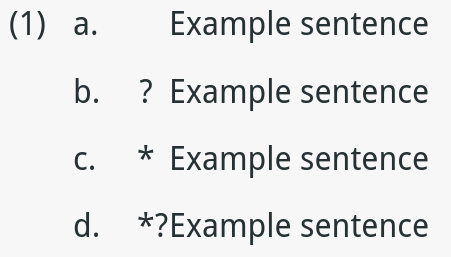
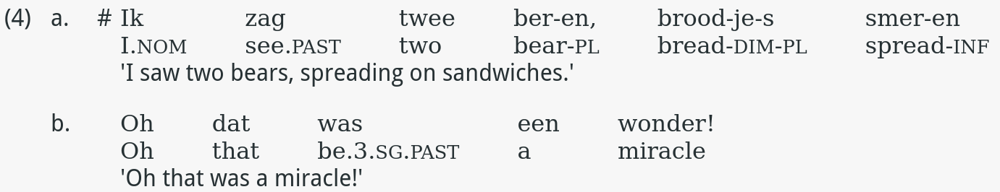

# HTMLEX

This repo contains a template for formatting linguistics examples in html.
The primary goals are to allow for automatic numbering across an html page, as well as ensure that all elements are correctly aligned.
It can be used for both single html pages for lingusitic examples, or for html based presentations, such as reveal.js.
The major purpose is to allow discussions and papers to be written relatively easily in html, which doesn't offer the functionality natively, so that blog posts and talks can make good use of the medium.


# Usage

1. Fork or clone the repo, or downloads the files as ZIP.
2. `linguistic-examples.css` should then be placed in an appropriate place in the directory you are writing in.
3. Call the file from your html document using `<link rel="stylesheet" href="PATH/TO/DIRECTORY/linguistic-examples.css">` using the appropriate path according to where you placed the file.
4. Use the appropriate containers according to the instructions below within the your html document.


## Single line examples

`linguistic-examples.css` defines a number of elements that should be used to format single line examples (i.e. where no glossing is required, for instance where the example is from the same language that the article is written in:

- `<div class="example-container">...</div>`: a div element that is the parent of the example.
- `<div class="individual-example">...</div>`: a div element, child of `example-container` that should be used to wrap the example elements for individual examples. Note
- `<div class="example-number">...</div>`: the parent div for the number of the example, *(1), (2) ... (n)*.
- `<p class="ex"></p>`: the counter for the numbering. Note that no text should be placed within the `<p>` tags, as the numbering is done automatially.
- `<div class="ab-counter">...</div>`: the parent div element for *a,b....n* numbering.
- `<p class="ab"></p>`: the counter for *a,b...n* numbering. This automatically resets when a `individual-example` div is used.
- `<div class="judgement">...</div>`: the parent div element for the judgement. **Note** that unlike the *(1), (2) ... (n)* numbering and *a, b ... c* numbering, this is *not* automatic, and thus you need to manually specify the judgement within a `<p>` element.
- `<div class="example-sentence">...</div>` the parent div element for the example itself. Again, the example should be placed within a `<p>` element.

Examples that are on a single line, i.e. without the need for glossing should use the following template:

```
<div class="example-container">
		<div class="individual-example">
			<div class="example-number"><p class='ex'></p></div>
			<div class="ab-counter"><p class='ab'></p></div>
			<div class="judgement"><p>*</p></div>
			<div class="example-sentence"><p>Example sentence</p></div>
		</div>
		<div class="individual-example">
			<div class="example-number"><p></p></div>
			<div class="ab-counter"><p class='ab'></p></div>
			<div class="judgement"><p>*</p></div>
			<div class="example-sentence"><p>Example sentence</p></div>
		</div>
		<div class="individual-example">
			<div class="example-number"><p></p></div>
			<div class="ab-counter"><p class='ab'></p></div>
			<div class="judgement"><p>*</p></div>
			<div class="example-sentence"><p>Example sentence</p></div>
		</div>
		<div class="individual-example">
			<div class="example-number"><p></p></div>
			<div class="ab-counter"><p class='ab'></p></div>
			<div class="judgement"><p>*?</p></div>
			<div class="example-sentence"><p>Example sentence</p></div>
		</div>
</div>
```

This will produce the following:



## Line-by-line glossing

Examples that include glossing require a different layout to the above, but some elements are common to both.
Elements specific to glossed examples are:

- `<div class="gloss-individual-example">...</div>`: the parent container of the individual example.
- `<div class="gloss-example">...</div>`: the outer container to hold the first two lines of the examples, i.e. the target sentence and the gloss line.
- `<ol class="sentence">...</ol>`: the inner container for the first two lines of the example.
- `<li class="gloss-individual-word">...</li>`: the outer container for the wrapping of the individual words of the example. **Note**: see [Known Bugs](#known-bugs) below.
- `<ol class="word">...</ol>`: the inner container that groups individual words and their associated gloss together.
- `<li lang=target-word>...</li>`: the position where individual words from the target language should go.
- `<li lang=target-gloss>...</li>`: the position where the gloss of the individual words should go.
- `<p class="translation">...</p>`: where the translation of the sentence should go.

As with the single line examples, the elements following elements should be used in the manner described above:

- `<div class="example-number">...</div>`
- `<p class="ex"></p>`
- `<div class="ab-counter">...</div>`
- `<p class="ab"></p>`
- `<div class="judgement">...</div>`

**Important**: only one word and its associated gloss should be placed in the appropriate `li` elements, and words and glosses should be grouped together within `<ol class="word">...</ol>`.
That is, do not put *all* the words of the sentence and their glosses within the same `li` elements.

Thus, glossed examples should be formatted as follows:

```
<div class="gloss-example-container">
            <div class='gloss-individual-example'>
            <div class='example-number'><p class='ex'></p></div>
            <div class="ab-counter"><p class='ab'></p></div>
            <div class='judgement'><p>#</p></div>
            <div class='gloss-example'>
                <ol class='sentence'>
                    <li class="gloss-inidividual-word">
                        <ol class='word'>
                            <li lang=target-word>Ik</li>
                            <li lang=target-gloss>I.<span class='smallcaps'>nom</span></li>
                        </ol>
                    </li>
                    <li class="gloss-inidividual-word">
                        <ol class='word'>
                            <li lang=target-word>zag</li>
                            <li lang=target-gloss>see.<span class='smallcaps'>past</span></li>
                        </ol>
                    </li>
                    <li class="gloss-inidividual-word">
                        <ol class='word'>
                            <li lang=target-word>twee</li>
                            <li lang=target-gloss>two</li>
                        </ol>
                    </li>
                    <li class="gloss-inidividual-word">
                        <ol class='word'>
                            <li lang=target-word>ber-en,</li>
                            <li lang=target-gloss>bear-<span class='smallcaps'>pl</span></li>
                        </ol>
                    </li>
                    <li class="gloss-inidividual-word">
                        <ol class='word'>
                            <li lang=target-word>brood-je-s</li>
                            <li lang=target-gloss>bread-<span class='smallcaps'>dim-pl</span></li>
                        </ol>
                    </li>
                    <li class="gloss-inidividual-word">
                        <ol class='word'>
                            <li lang=target-word>smer-en</li>
                            <li lang=target-gloss>spread-<span class='smallcaps'>inf</span></li>
                        </ol>
                    </li>
                </ol>

            <p class='translation'>'I saw two bears, spreading on sandwiches.'</p>
            </div>
            </div>
            <div class='gloss-individual-example'>
                <div class='example-number'><p></p></div>
                <div class="ab-counter"><p class='ab'></p></div>
                <div class='judgement'><p></p></div>
                <div class='gloss-example'>
                    <ol class='sentence'>
                        <li class="gloss-inidividual-word">
                            <ol class='word'>
                                <li lang=target-word>Oh</li>
                                <li lang=target-gloss>Oh</li>
                            </ol>
                        </li>
                        <li class="gloss-inidividual-word">
                            <ol class='word'>
                                <li lang=target-word>dat</li>
                                <li lang=target-gloss>that</li>
                            </ol>
                        </li>
                        <li class="gloss-inidividual-word">
                            <ol class='word'>
                                <li lang=target-word>was</li>
                                <li lang=target-gloss>be.<span class='smallcaps'>3.sg.past</span></li>
                            </ol>
                        </li>
                        <li class="gloss-inidividual-word">
                            <ol class='word'>
                                <li lang=target-word>een</li>
                                <li lang=target-gloss>a</li>
                            </ol>
                        </li>
                        <li class="gloss-inidividual-word">
                            <ol class='word'>
                                <li lang=target-word>wonder!</li>
                                <li lang=target-gloss>miracle</li>
                            </ol>
                        </li>
                    </ol>

                <p class='translation'>'Oh that was a miracle!'</p>
                </div>
                </div>
        </div>
```

And this will produce the following:



## Tips

Though the `ex` and `ab` counters can both be called without wrapping them in the `example-number` and `ab-counter` divs as suggested above, best practice dictates that you should still do so.
In particular in the case of the `ab-counter`, it is important to wrap all examples in the `example-container` div, so that the counter is reset between examples

The `line-height` value of `example-container` should be adjusted according to your needs to set the line spacing of examples.
The default value, `0.1` looks the nicest and was what was used in the screenshots above, but the value depends according to the rest of the document.

# Availability

## Tested Browsers

At the time of writing this works on Firefox (v71), Chromium/Chrome (v78) and Safari (v13).

##

It works in a regular .html document, and has been tested in both [reveal.js](https://github.com/hakimel/reveal.js/) and [impress.js](https://github.com/impress/impress.js).

## Known Bugs

I have found a difference in the height of the glossing examples between using Linux and macOS.
When used on linux computers, the examples appear one line too low relative to the judgement marker and the number counter.
To fix this, the value of `gloss-individual-word` should be set to `-1em;` when using linux (if the problem appears, I have only tested it on Arch-based distros).
I haven't tested the behaviour on Windows, so I don't know if similar behaviour arises.

# Contributors

The major contributor is [Peter W. Smith](https://pwsmith.github.io), but the glossing template was modified from [this answer](https://linguistics.stackexchange.com/a/159) on stackexchange to a question about interlinear glossing.
Thus, a lot of credit is due to [Pat](https://linguistics.stackexchange.com/users/136/pat), the author of the answer, for how to get the glosses lined up with the words.

# License

Made available under the [MIT License](LICENSE.md)

# Contributing

My css skills are not all that advanced, so I'm sure there's better, less hacky ways of doing this.
Please feel free to offer suggestions of improvement either by [contacting me](https://pwsmith.github.io) or open a pull request.
